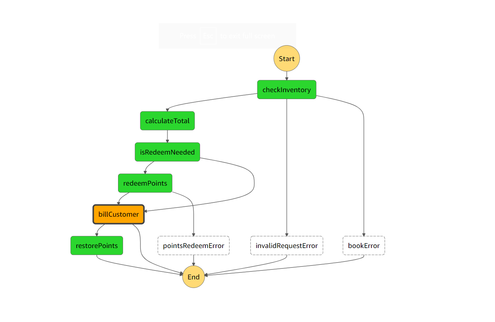

Whole Process:

Sample request payload for the step function:
``{"userId": 1,  "bookId: "1", "quantity": 1, "pointsRedeemed": 12}``

1) Create two dynamodb tables, named - "books" (partition key: "bookId") and "users"(partition key: "userId")
 - Sample entity for users table 
   ``{"userId": "1", "points": 100, "name": "Tom"}``
- Sample entity for books table
  ``{"bookId": "1", "quantity": 100, "name": "Taranath Tantrik", "price": 25}``

2) Change the arn of the two tables (books and users) in references of the serverless.yml file

3) Deploy changes: ``npx sls deploy``

